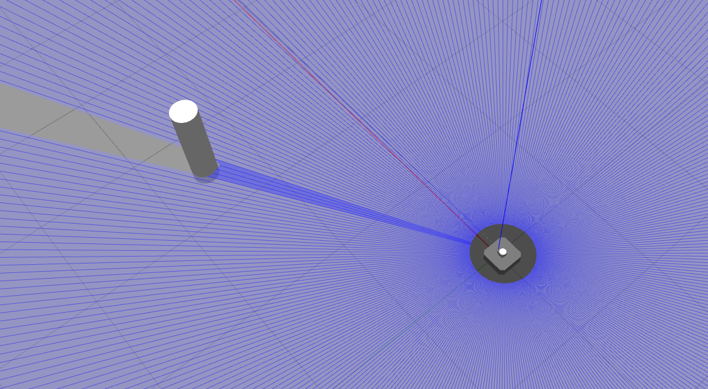
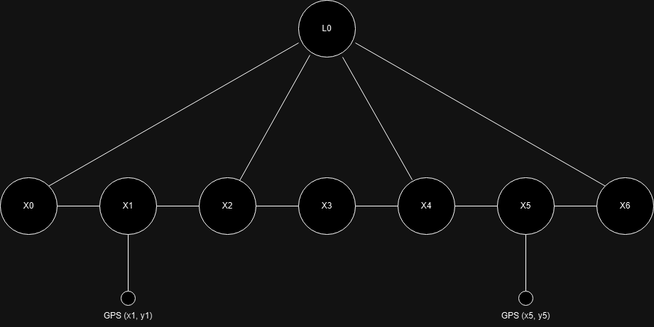

# Projekt SIwR

Jakub Junkiert 2024

## Cel projektu

Projekt polega na stworzeniu systemu estymacji stanu robota wykorzystującego probablistyczne modele grafowe. System ma za zadanie lokalizować robota dwukołowego w znanej mapie na podstawie informacji pochodzącej z wielu czujników.

## Opis działania

Program wykorzystuje probabilistyczny model grafowy stworzonony z wykorzystaniem biblioteki gtsam. Graf jest budowany na podstawie pomiarów z trzech sensorów: odometrii, GPS oraz skanera laserowego, wykrywającego "landmark" o znanej pozycji w świecie.


Na powyższym obrazku przedstawiony jest wynik działania programu. Układ współrzędnych w prawym dolnym rogu jest układem bazowym. Układ znajdujący się przy robocie jest estymowaną przez program pozycją robota. Fioletowa elipsoida określa niepewność estymowanej pozycji.

### Robot:

Wykorzystany robot to zmodyfikowany Turtlebot3_waffle, wzbogacony o sensor GPS znajdujący się w środku base_frame. Posiada on następujące sensory:

- Czujnik odometrii odczytujący obroty kół z częstotliwością 20 Hz,
- Czujnik GPS odczytujący szerokość i długość geograficzną z częstotliwością 1 Hz,
- Czujnik laserowy 2D, skanujący przestrzeń wokół robota z rozdzielczością 1 stopnia kątowego i zasięgu 10 m, z częstotliwością odczytu 2 Hz.

### Świat:

Robot umieszczony jest w świecie zamodelowanym w symulatorze Gazebo. Świat zawiera tylko podłogę, robota oraz "landmark" służący do lokalizacji z wykrozystaniem skanera laserowego. Landmark jest w rzeczywistości walcem o wysokości 1 m i średnicy 25 cm. Robot może się poruszać w dowolnym kierunku na płaszczyźnie XY.



### Skrypt lokalizujący

Algorytm estymacji lokalizacji stworzony jest w pliku *localiser.py*. Zawiera on trzy subskrybenty tematów: */odom*, */gps/data* oraz */scan*. Estymowana pozycja, wraz z niepewnością publikowana jest do wiadomości */estimated_pose*.

#### Graf

Przybliżona struktura grafu jest następująca:



Wierzchołki X0...Xn reprezentują kolejne pozycje robota.

Krawędzie pomiędzy nimi są pomiarami z odometrii.

Wierzchołek L0 reprezentuje pozycję znalezionego landmarka a krawędzie pomiędzy nim a wierzchołkami Xn reprezentują zmierzoną odległość oraz kąt.

Czynniki unarne GPS(xn, yn) reprezentują odczytane przez GPS położenie robota.

Tak jak widać na powyższym schemacie, częstotliowść przypływu danych z różnych czujników jest inna. Ze względu na dużą częstotliwość pozycji estymowanych przez odometrię, po otrzymaniu dancyh ze skanera laserowego lub GPS, są one łączone z ostatnim wierzchołkiem z odometrii.

#### Działanie programu

Program odczytuje pozycję z odometrii a następnie dodaje nowy wierzchołek do grafu. Po tym dokonywana jest optymalizacja grafu i opublikowanie wiadomości z estymowaną lokalizacją.

Wiadomości z GPS i skanera laserowego odczytywane są rzadziej i dodawane są odpowiednio do grafu ale nie następuje bezpośrednio po nich optymalizacja grafu aby nie duplikować tej operacji.

## Uruchamianie

Należy zainstalować dodatkową bibliotekę do Pythona:
```bash
pip install utm
```

Pakiet należy zbudować:
```bash
colcon build
. install/setup.bash
```

Paczkę uruchamia się komendą:
```bash
ros2 launch projekt_siwr projekt_siwr.launch.py
```
W wyniku jej wywołania powinien się uruchomić Rviz2 z robotem na środku mapy, z widoczną strzałką oznaczającą przewidywaną pozycją robota oraz z widocznymi punktami będącymi skanem laserowym, wyszukującym pozycję landmarka.

W celu poruszania robotem można uruchomić program:
```bash
export TURTLEBOT3_MODEL=waffle
ros2 run turtlebot3_teleop teleop_keyboard
```
