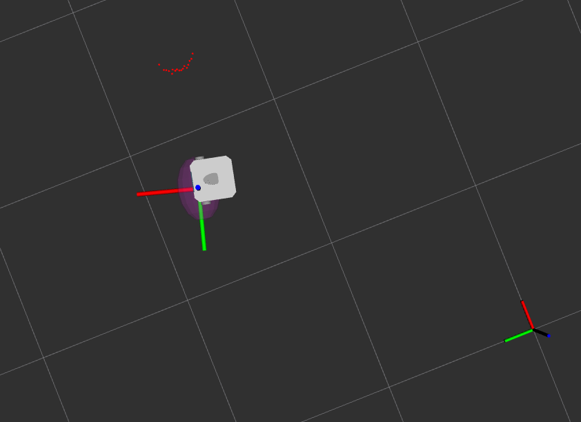

# Projekt SIwR

Jakub Junkiert 2024

## Cel projektu

Projekt polega na stworzeniu systemu estymacji stanu robota wykorzystującego probablistyczne modele grafowe. System ma za zadanie lokalizować robota dwukołowego w znanej mapie na podstawie informacji pochodzącej z wielu czujników.



## Opis działania

Program wykorzystuje probabilistyczny model grafowy stworzoony z wykorzystaniem biblioteki gtsam. Graf jest stworzony na podstawie pomiarów z trzech sensorów: odometrii, GPS oraz skanera laserowego, wykrywającego "landmark" o znanej pozycji w świecie.

## Uruchamianie

Należy zainstalować dodatkową bibliotekę do Pythona:
```bash
pip install utm
```

Pakiet należy zbudować:
```bash
colcon build
. install/setup.bash
```

Paczkę uruchamia się komendą:
```bash
ros2 launch projekt_siwr projekt_siwr.launch.py
```
W wyniku jej wywołania powinien się uruchomić Rviz2 z robotem na środku mapy, z widoczną strzałką oznaczającą przewidywaną pozycją robota oraz z widocznymi punktami będącymi skanem laserowym, wyszukującym pozycję landmarka.

W celu poruszania robotem można uruchomić program:
```bash
export TURTLEBOT3_MODEL=waffle
ros2 run turtlebot3_teleop teleop_keyboard
```
